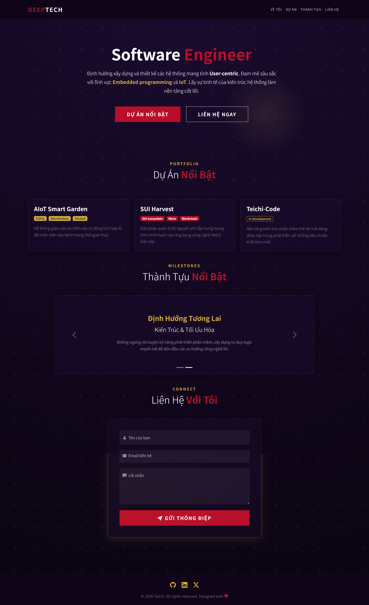
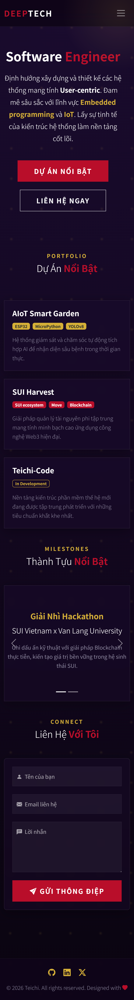

# Personal Portfolio - Lab03

[](https://lab03-gamma.vercel.app)

## Overview

Welcome to the **Personal Portfolio - Lab03**. This project serves as the digital portfolio of a Software Engineer dedicated to architecting **User-centric** systems. Driven by a profound passion for **Embedded Programming (IoT)** and **Web3** technologies, this platform is built to showcase a harmonious blend of logic and aesthetics.

The visual direction follows a **"Cinematic Deep Tech"** approach, deeply inspired by a **Minimalist Japanese aesthetic**. It utilizes a sophisticated color palette featuring **Midnight Purple** as the void-like canvas, accented by striking **Crimson** highlights and elegant **Gold** touches to create a captivating, professional, and immersive user experience.

---

## Web Interface (Giao diện trang web)

> *Note: Please replace the placeholder links below with actual screenshots of the deployed site.*

### Desktop View


### Mobile View


---

## Tech Stack

This project is built as a high-performance static site without the overhead of heavy build tools. It was constructed utilizing standard web technologies alongside rapid prototyping tools:

- **HTML5, CSS3 & JavaScript**: Core semantic structure, styling, and pure JS for smooth cursor glow animations and form validation.
- **Bootstrap 5**: The primary mobile-first responsive design framework (structured via Bootstrap Studio conventions).
- **Bootstrap Grid System**: Extensively used (`container`, `row`, `col-*`) to ensure pixel-perfect alignment and responsiveness across all device viewports.
- **Custom CSS Glassmorphism**: Tailored backdrop filters (`backdrop-filter: blur`), custom box-shadows, and translucent dark backgrounds to enhance the cinematic depth and elegance of the UI components.

---

## Projects & Milestones

This portfolio proudly exhibits cutting-edge projects and key achievements:

### Featured Projects
- **AIoT Smart Garden**: An automated monitoring and care system integrating computer vision for real-time anomaly detection. *(Technologies: ESP32, MicroPython, YOLOv8)*
- **SUI Harvest**: A highly transparent, decentralized resource management solution leveraging modern Web3 architecture. *(Technologies: SUI ecosystem, Move, Blockchain)*
- **Zafkiel-Code**: A next-generation software architecture platform currently under rigorous development. *(Status: In Development)*

### Key Achievements
- **2nd Place Winner - Hackathon SUI Vietnam x Van Lang University**: Recognized for delivering a highly practical Blockchain solution that contributes sustainable value to the SUI ecosystem.

---

## Folder Structure

```text
lab03
 ┣ index.html       # The main HTML structure containing all UI components
 ┣ style.css        # Custom styles, animations, and Glassmorphism effects
 ┣ bg.png           # The cinematic fluid gradient background image
 ┣ vercel.json      # Static routing and caching configuration for Vercel
 ┣ DEPLOY.md        # Step-by-step Vercel CLI deployment guide
 ┗ README.md        # Project documentation (This file)
```

---

## How to Run Locally

Since this is a static website, getting it running on your local machine is incredibly straightforward and requires no package installation:

1. **Clone or Download** this directory to your local machine.
2. **Direct Browser Execution**: Simply double-click the `index.html` file to open it directly in your default web browser (Chrome, Edge, Firefox, Safari, etc.).
3. **Using Live Server (Recommended)**: 
   - If you are using **Visual Studio Code**, install the [Live Server](https://marketplace.visualstudio.com/items?itemName=ritwickdey.LiveServer) extension.
   - Right-click on the `index.html` file and select **"Open with Live Server"**. This will spin up a local development server with hot-reloading enabled, updating the page instantly as you make changes to the code.
